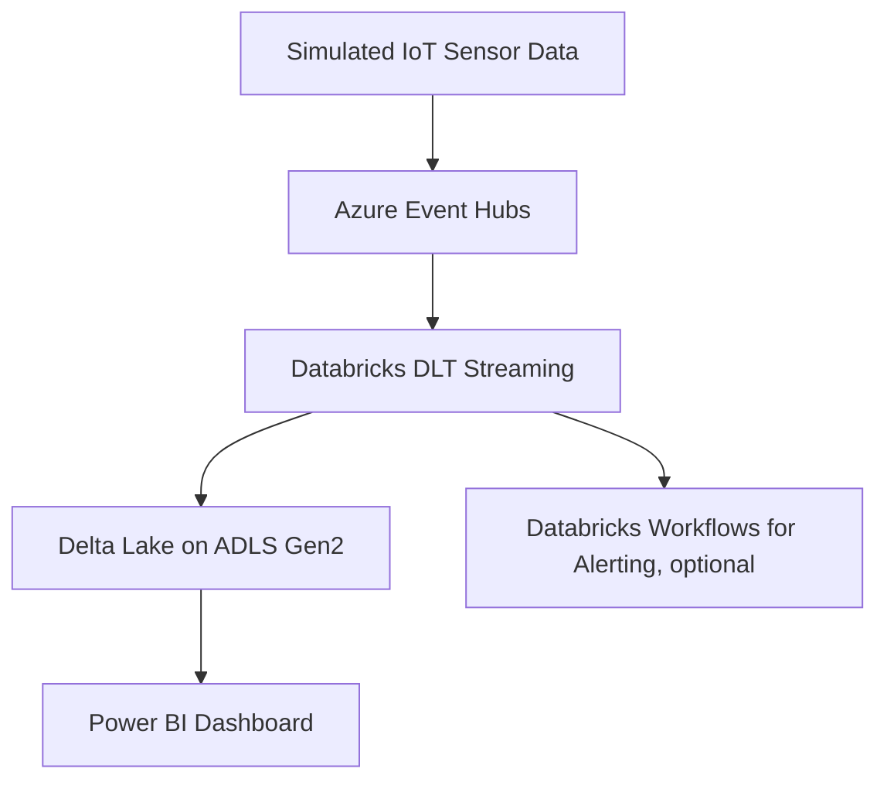

# Azure-Event-Hubs-Pipeline
This repo shows the connectivity and event processing using databricks DLT and workflows
# Real-Time IoT Data Pipeline Using Azure Event Hubs + Databricks DLT + Power BI

## 🚀 Overview

This project is a production-ready real-time analytics pipeline designed for streaming IoT data. It uses Azure Event Hubs for ingestion, Databricks Delta Live Tables (DLT) for stream processing, Azure Key Vault for secure credential management, and Power BI for interactive dashboards.

> 💡 **Goal**: Detect anomalies in real-time sensor data and visualize metrics using a lakehouse architecture.

---

## 🧭 Architecture

