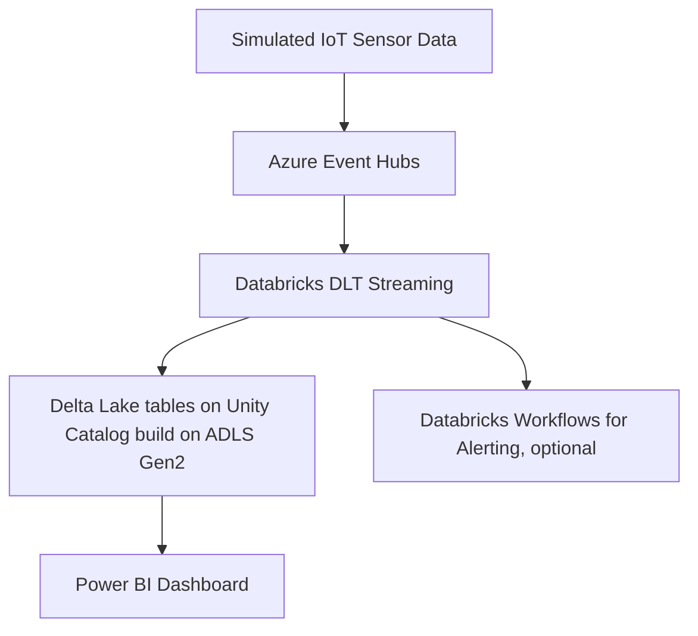

# Azure-Event-Hubs-Pipeline
This repo shows the connectivity and event processing using databricks DLT and workflows
# Real-Time IoT Data Pipeline Using Azure Event Hubs + Databricks DLT + Power BI

## 🚀 Overview

This project is a production-ready real-time analytics pipeline designed for streaming IoT data. It uses Azure Event Hubs for ingestion, Databricks Delta Live Tables (DLT) for stream processing, Azure Key Vault for secure credential management, and Power BI for interactive dashboards.

> 💡 **Goal**: Detect anomalies in real-time sensor data and visualize metrics using a lakehouse architecture.

---

## 🧭 Architecture

## 🧰 Tech Stack
Azure Event Hubs: Real-time ingestion of telemetry

Databricks DLT: Stream processing, schema enforcement, Delta Lake

Azure Key Vault: Secure management of secrets (Event Hub credentials, tokens)

Azure Data Lake Storage Gen2: Scalable storage for bronze/silver/gold data layers

Power BI: Real-time reporting and dashboards

Databricks Workflows: Job orchestration and monitoring

GitHub Actions: CI/CD for deploying notebooks and jobs

## 📁 Lakehouse Layers
Bronze Layer: Raw sensor data from Event Hubs

Silver Layer: Cleansed & transformed data

Gold Layer: Aggregated KPIs for dashboards and alerts

## 📊 Sample Use Case
Use Case: Monitor factory temperature and humidity sensors. Trigger alerts when thresholds are crossed and visualize the trends.

## ⚙️ Setup Instructions
Create and configure Azure Event Hub

Deploy Databricks notebooks using GitHub Actions or Databricks CLI

Set up Key Vault-backed secret scope

Configure Delta Live Tables pipeline (bronze → silver → gold)

Create Power BI dashboard with DirectLake or Delta refresh

(Optional) Deploy Azure Function for alerting via email or webhook
